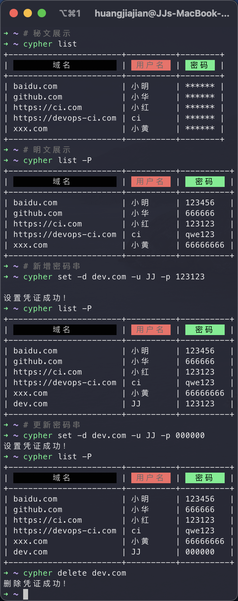

## Cypher

> Author: JJ-H	Email: 1916787042@qq.com
>
> 诞生背景：笔者所在的公司遍布着各类应用环境，从 开发环境 -> ci 环境 -> 灰度环境 -> 预生产环境 -> 正式环境，各类业务线交错，以及各类 k8s 的环境，密码管理就成了个十分头痛的事情（当然市面上有很多密码管理工具，但如果有一类cli工具来满足咱们这帮Geek，那真是 泰裤辣！！！），因此笔者在工作之余，开发了这款终端密码管理工具 `cypher` （未来将支持 桌面端/Web GUI～）




## Usage

可通过 help 命令查看帮助文档

```shell
➜ ~ cypher --help
You can easily manage your credentials with cypher 
like set、get、list、delete and so on.

Usage:
  cypher [command]

Available Commands:
  completion  Generate the autocompletion script for the specified shell
  delete      Delete a specified cypher, Usage: cypher delete [domain]
  get         Get a specified domain cypher, Usage: cypher get [domain]
  help        Help about any command
  list        List all cyphers, Usage: cypher list [-P]
  server      Start a server
  set         Set a cypher for a specified domain，Usage: cypher set -d [domain] -u [username] -p [password]
  version     Print cypher version, Usage: cypher version

Flags:
  -h, --help   help for cypher

Use "cypher [command] --help" for more information about a command.
```

## Example

- list cyphers：`cypher list [-P]`

  ```shell
  # 密文列表
  ➜ ~ cypher list
  +-----------------------+----------+---------+
  |         域名           |  用户名   |  密码   |
  +-----------------------+----------+---------+
  | abc.com               | JJ       | ******  |
  | xzy.com               | Bob      | ******  |
  | 123.com               | Alice    | ******  |
  | xxx.com               | John     | ******  |
  | https://devops-ci.com | ci       | ******  |
  +-----------------------+----------+---------+

  # 明文列表
  ➜ ~ cypher list -P
  +-----------------------+----------+---------+
  |         域名           |  用户名   |  密码   |
  +-----------------------+----------+---------+
  | abc.com               | JJ       | 123456  |
  | xzy.com               | Bob      | 666666  |
  | 123.com               | Alice    | 888888  |
  | xxx.com               | John     | 999999  |
  | https://devops-ci.com | ci       | 000000  |
  +-----------------------+----------+---------+
  ```

- 获取指定域名的密码：`cypher get {domain}`

  ```shell
  ➜ ~ cypher get abc.com
  密码已复制到剪切板！
  ```

- 增加指定域名密码: `cypher set -d {domain} -u {username} -p {password} `

  ```shell
  ➜ ~ cypher set -d hello.com -u test -p 111111
  设置凭证成功！
  ➜ ~ cypher list -P
  +-----------------------+----------+---------+
  |         域名           |  用户名   |  密码   |
  +-----------------------+----------+---------+
  | abc.com               | JJ       | 123456  |
  | xzy.com               | Bob      | 666666  |
  | 123.com               | Alice    | 888888  |
  | xxx.com               | John     | 999999  |
  | https://devops-ci.com | ci       | 000000  |
  | hello.com             | test     | 111111  |
  +-----------------------+----------+---------+
  ```
- 删除指定域名密码: `cypher delete {domain}`

  ```shell
  ➜ ~ cypher delete hello.com
  删除凭证成功！
  ➜ ~ cypher list -P
  +-----------------------+----------+---------+
  |         域名           |  用户名   |  密码   |
  +-----------------------+----------+---------+
  | abc.com               | JJ       | 123456  |
  | xzy.com               | Bob      | 666666  |
  | 123.com               | Alice    | 888888  |
  | xxx.com               | John     | 999999  |
  | https://devops-ci.com | ci       | 000000  |
  +-----------------------+----------+---------+
  ```
- 获取 cypher 版本

  ```shell
  ➜ ~ cypher version
  cipher version 1.0.0
  ```
