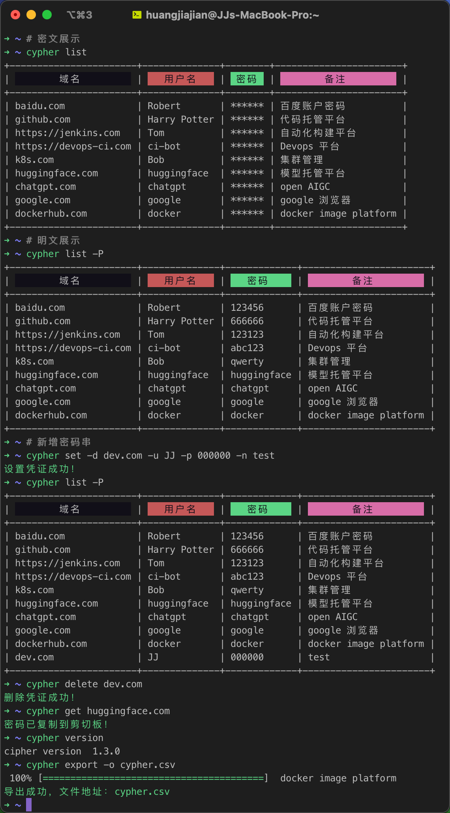

## Cypher

<div align="center">
  
</div>

> Author: JJ-H	Email: 1916787042@qq.com
>
> 诞生背景：笔者所在的公司遍布着各类应用环境，从 开发环境 -> ci 环境 -> 灰度环境 -> 预生产环境 -> 正式环境，各类业务线交错，以及各类 k8s 的环境，密码管理成了个十分头痛的事情（当然市面上有很多密码管理工具，但如果有一类cli工具来满足咱们这帮Geek，那真是 泰裤辣！！！），因此笔者在工作之余，开发了这款终端密码管理工具 `cypher`

### 桌面端效果


### Command Line 效果



## Usage

> 为了方便大家开箱即用，目前 cypher 采用了最简单的存储模式：文件存储，密码将以 json 格式的形式存储在 ~/cypher.json 文件中，后续将通过配置的方式支持数据库等存储模式。

```shell
# 拉取本仓库代码
git clone https://github.com/JJ-H/cypher.git

cd cypher

go mod tidy
```

### 桌面应用构建方式

```shell
wails build
```

根据机器架构，自行替换 wails.json 中的架构为 arm64、amd64 等

上述指令将在 build/bin 下生成一个对应平台的应用程序，将其复制至应用程序即可

### Command Line Tool 构建方式


1、配置【可选】
cypher 目前支持两种密码存储模式

- 明文存储

  ```json
    [
      {
        "id":5577006791947779410,
        "domain":"test.com",
        "username":"JJ-H",
        "password":"123456"
      }
    ]
  ```
- 密文存储

  ```json
    [
      {
        "id":5577006791947779410,
        "domain":"test.com",
        "username":"JJ-H",
        "password":"OBGm7t0Ajeb66E2hkVUhOA7EuUdz7A=="
      }
    ]
  ```

  其中明文存储不需要配置，但是不安全，因此建议使用密文存储，密文存储需要配置 `~/.cypher_config.ini` 文件，配置如下：

  ```ini
  app_name = "Cipher"

  [crypto]
  type = "AES"
  ;须确保密钥长度为 16 位的随机字符串
  key = "1234567890123456"
  ```

2、构建可执行程序，执行文件 `cypher` 拷贝到 `/usr/local/bin` 目录下

```shell
cd cypher

# 构建可执行文件
go build -o bin/cypher cmd/main.go

cp bin/cypher /usr/local/bin
```

通过 help 命令查看帮助文档

```shell
➜ ~ cypher --help
You can easily manage your ciphers with cypher
like set、get、list、delete and so on.

Usage:
  cypher [command]

Available Commands:
  completion  Generate the autocompletion script for the specified shell
  delete      Delete a specified cypher, Usage: cypher delete [domain]
  export      Export cypher data to a file
  get         Get a specified domain cypher, Usage: cypher get [domain]
  help        Help about any command
  list        List cyphers, Usage: cypher list [options]
  server      Start a server
  set         Set a cypher for a specified domain，Usage: cypher set -d [domain] -u [username] -p [password]
  version     Print cypher version, Usage: cypher version

Flags:
  -h, --help   help for cypher

Use "cypher [command] --help" for more information about a command.
```

## Example

- list cyphers：`cypher list [-P]`

  ```shell
  # 密文列表
  ➜ ~ cypher list
  +-----------------------+--------------+--------+-----------------------+
  |         域名           |    用户名    |  密码   |         备注           |
  +-----------------------+--------------+--------+-----------------------+
  | baidu.com             | Robert       | ****** | 百度账户密码            |
  | github.com            | Harry Potter | ****** | 代码托管平台            |
  | https://jenkins.com   | Tom          | ****** | 自动化构建平台          |
  | https://devops-ci.com | ci-bot       | ****** | CICD平台              |
  | k8s.com               | Bob          | ****** | 集群管理               |
  | huggingface.com       | huggingface  | ****** | 模型托管平台            |
  | chatgpt.com           | chatgpt      | ****** | open AIGC             |
  | google.com            | google       | ****** | google 浏览器          |
  | dockerhub.com         | docker       | ****** | docker image platform |
  +-----------------------+--------------+--------+-----------------------+

  # 明文列表
  ➜ ~ cypher list -P
  +-----------------------+--------------+-------------+-----------------------+
  |         域名           |    用户名     |    密码     |         备注           |
  +-----------------------+--------------+-------------+-----------------------+
  | baidu.com             | Robert       | 123456      | 百度账户密码            |
  | github.com            | Harry Potter | 666666      | 代码托管平台            |
  | https://jenkins.com   | Tom          | 123123      | 自动化构建平台          |
  | https://devops-ci.com | ci-bot       | abc123      | CICD平台              |
  | k8s.com               | Bob          | qwerty      | 集群管理               |
  | huggingface.com       | huggingface  | huggingface | 模型托管平台            |
  | chatgpt.com           | chatgpt      | chatgpt     | open AIGC             |
  | google.com            | google       | google      | google 浏览器          |
  | dockerhub.com         | docker       | docker      | docker image platform |
  +-----------------------+--------------+-------------+-----------------------+
  ```
- 获取指定域名的密码：`cypher get {domain}`

  ```shell
  ➜ ~ cypher get k8s.com
  密码已复制到剪切板！
  ```
- 增加指定域名密码: `cypher set -d {domain} -u {username} -p {password} `

  ```shell
  ➜ ~ cypher set -d hello.com -u test -p 111111
  设置凭证成功！
  ➜ ~ cypher list -P
  +-----------------------+--------------+-------------+-----------------------+
  |         域名           |    用户名     |    密码      |         备注          |
  +-----------------------+--------------+-------------+-----------------------+
  | baidu.com             | Robert       | 123456      | 百度账户密码            |
  | github.com            | Harry Potter | 666666      | 代码托管平台            |
  | https://jenkins.com   | Tom          | 123123      | 自动化构建平台          |
  | https://devops-ci.com | ci-bot       | abc123      | Devops 平台           |
  | k8s.com               | Bob          | qwerty      | 集群管理               |
  | huggingface.com       | huggingface  | huggingface | 模型托管平台            |
  | chatgpt.com           | chatgpt      | chatgpt     | open AIGC             |
  | google.com            | google       | google      | google 浏览器          |
  | dockerhub.com         | docker       | docker      | docker image platform |
  | hello.com             | test         | 111111      | test                  |
  +-----------------------+--------------+-------------+-----------------------+
  ```
- 删除指定域名密码: `cypher delete {domain}`

  ```shell
  ➜ ~ cypher delete hello.com
  删除凭证成功！
  ➜ ~ cypher list -P
  +-----------------------+--------------+-------------+-----------------------+
  |         域名           |    用户名     |    密码     |         备注           |
  +-----------------------+--------------+-------------+-----------------------+
  | baidu.com             | Robert       | 123456      | 百度账户密码            |
  | github.com            | Harry Potter | 666666      | 代码托管平台            |
  | https://jenkins.com   | Tom          | 123123      | 自动化构建平台          |
  | https://devops-ci.com | ci-bot       | abc123      | CICD平台              |
  | k8s.com               | Bob          | qwerty      | 集群管理               |
  | huggingface.com       | huggingface  | huggingface | 模型托管平台            |
  | chatgpt.com           | chatgpt      | chatgpt     | open AIGC             |
  | google.com            | google       | google      | google 浏览器          |
  | dockerhub.com         | docker       | docker      | docker image platform |
  +-----------------------+--------------+-------------+-----------------------+
  ```
- 导出 csv

  ```shell
  ➜ ~ cypher export -o ~/Desktop/cypher.csv
  导出成功，文件地址：/Users/xxxx/Desktop/cypher.csv
  ```
- 获取 cypher 版本

  ```shell
  ➜ ~ cypher version
  cipher version 1.0.0
  ```
